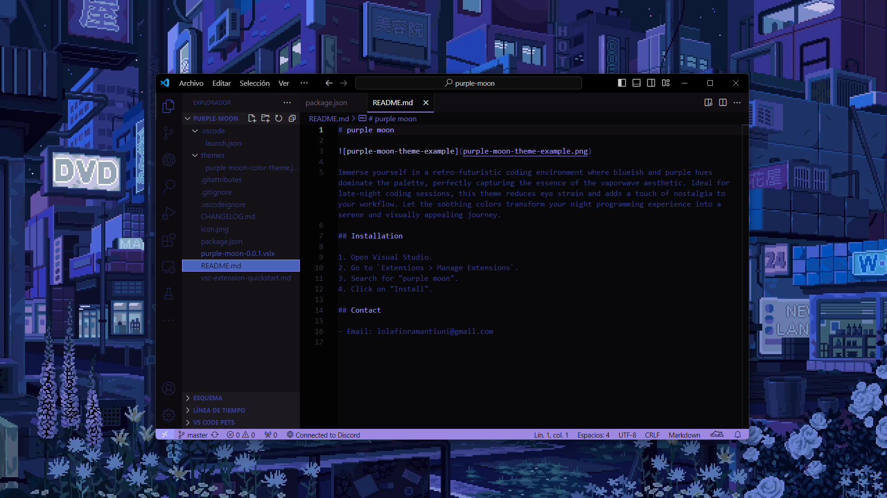

# purple moon

Immerse yourself in a retro-futuristic coding environment where blueish and purple hues dominate the palette, perfectly capturing the essence of the vaporwave aesthetic. Ideal for late-night coding sessions, this theme reduces eye strain and adds a touch of nostalgia to your workflow. Let the soothing colors transform your night programming experience into a serene and visually appealing journey.

## Installation

1. Open Visual Studio.
2. Go to `Extensions > Manage Extensions`.
3. Search for "purple moon".
4. Click on "Install".

## Contact

- Email: lolafioramantiuni@gmail.com
